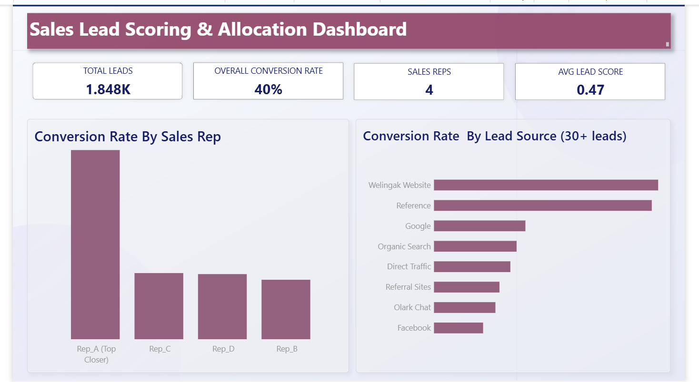

# Sales Lead Scoring & Allocation

## Problem
This project solves two connected problems: (1) predicting which leads are
likely to convert into paying customers, and (2) using those predictions to
fairly and effectively distribute leads across a sales team.

## 📊 Dataset
Real lead data from an EdTech company (X Education), sourced from Kaggle —
~9,240 leads, including behavior data like time spent on the website, lead
source, and occupation. Column definitions are documented in
`data/Leads Data Dictionary.xlsx`.

## Steps

**1. Data Cleaning (Python)**
Removed unwanted columns and handled missing values — including columns
disguised as "Select" (a leftover dropdown default), columns missing
40%+ of their data, columns with data leakage (like `Lead Quality` and `Tags`,
which are only known *after* a sales call), and columns with near-zero
variance (where almost every row gave the same answer).

**2. SQL Analysis (MySQL)**
Loaded the cleaned data into MySQL and used `GROUP BY`, `HAVING`, and the
`RANK() OVER (PARTITION BY ...)` window function to analyze conversion rate
by lead source and rank leads by engagement within each source.

**3. Feature Selection**
Selected 12 final columns for modeling, based on three tested rules:
missingness, leakage, and variance — each verified with real data, not assumptions.

**4. Exploratory Data Analysis (Python)**
Used a correlation heatmap, histogram, and bar chart to visually confirm
patterns — including that `Total Time Spent on Website` is the strongest
numeric predictor of conversion, and that only 8 lead sources have enough
volume (30+ leads) to be trustworthy for comparison.

**5. Model Building**
Train/test split (80/20) on 12 features. Built a Logistic Regression model
with `class_weight='balanced'` to better handle the moderate class imbalance
(62% not converted / 38% converted), chosen specifically because it's
explainable to a non-technical sales manager, unlike a black-box model.

**Results:** Accuracy 0.78, Recall (class 1) 0.73, Precision (class 1) 0.72,
ROC-AUC 0.835

**6. Lead Scoring**
Used the trained model to generate a `lead_score` (probability of converting)
for every lead in the test set.

**7. Lead Allocation**
Sorted leads by `lead_score`. Top 25% assigned to a simulated top-performing
rep (Rep_A); remaining 75% distributed evenly across 3 other reps using
round-robin.

## 🎯 Result — Does It Actually Work?
To test whether the scoring system was actually working — not just
distributing leads randomly — I compared the conversion rate of each rep's
leads, since every rep was given the exact same count of leads by design.

The results showed Rep_A's leads converted at **79.9%**, compared to roughly
**25-28%** for Rep_B, Rep_C, and Rep_D. Since every rep received an equal
number of leads, this difference in rate proves the lead-scoring model is
genuinely identifying which leads are more likely to buy — not just
producing plausible-looking scores.

## 📈 Dashboard
Built an interactive Power BI dashboard to make these results usable by a
non-technical sales manager — without needing to open Python or understand
the model at all.

**KPI Overview:**
- Total Leads: 1,848
- Overall Conversion Rate: 40.1%
- Sales Reps: 4
- Average Lead Score: 0.47

**Charts:**
- *Conversion Rate by Sales Rep* — the core proof chart, visually showing
  Rep_A's ~80% conversion rate against the ~25-28% round-robin group
- *Conversion Rate by Lead Source (30+ leads only)* — filtered to reliable
  sample sizes, showing Welingak Website and Reference as the strongest
  channels



*(.pbix file also included in the `dashboard/` folder for anyone who wants
to open and interact with it directly in Power BI.)*

## What I'd Improve Next
- Add a filterable detail table so a manager can click a rep and see their
  individual assigned leads
- Try comparing Logistic Regression against a Random Forest or XGBoost
  model, to measure exactly how much accuracy is being traded away for
  explainability
- Make the allocation rule smarter by factoring in each rep's current
  workload, not just a flat round-robin split

## Project Structure

```
lead-scoring-allocation/
├── data/
│   ├── Lead Scoring.csv
│   └── Leads Data Dictionary.xlsx
├── notebook/
│   └── pipeline.ipynb
├── sql/
│   └── SQL_lead.sql
├── outputs/
│   └── lead_allocation_results_readable.csv
├── dashboard/
│   ├── lead_scoring_dashboard.pbix
│   └── dashboard_screenshot.png
├── notes.md
└── README.md
```

## Tech Stack
`Python` `Pandas` `Scikit-learn` `MySQL/SQL` `Matplotlib` `Seaborn` `Power BI`

## Author & Contact
- **Author:** Shamila Shirin
- **Email:** shamilashirin32@gmail.com
- **LinkedIn:** 🔗 [Shamila Shirin](https://www.linkedin.com/in/shamila-shirin)
- **GitHub:** 🔗 [shamila-shirin-mk](https://github.com/shamila-shirin-mk)
